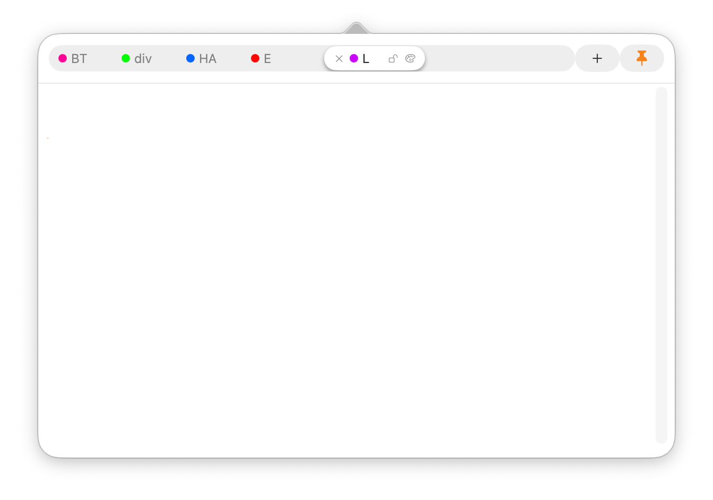

# xNotes

xNotes is a lightweight macOS menu bar notes app. It keeps notes in tabs, supports quick export, and offers a minimal settings panel for editor preferences.

## Features
- Menu bar popover for fast access
- Multiple tabs with titles and colors
- Lock tabs to prevent accidental close
- Auto title from the first non-empty line
- Export all notes to a text file
- Editor font and size settings
- Optional “keep window open” pin

## Shortcuts
- `⌘1` … `⌘9` select tabs 1–9
- Right‑click the menu bar icon for export and quit

## Requirements
- macOS 13+ for “Launch at Login” toggle (older systems will ignore it)

## Notes
- Notes are stored locally in `UserDefaults` under the key `savedNotes`.

## Build
Open `xNotes.xcodeproj` in Xcode and run.
