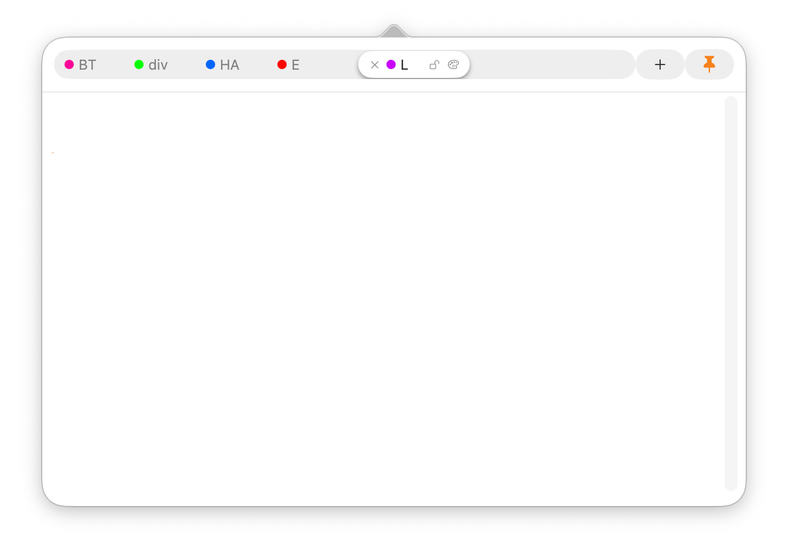

# xNotes

xNotes is a lightweight macOS menu bar notes app. It keeps notes in tabs, includes a dedicated clipboard history tab, and offers fast search, backup, and text utilities.

## Features
- Menu bar popover for fast access
- Multiple tabs with titles and colors
- Lock tabs to prevent accidental close
- Auto title from the first non-empty line
- Clipboard history tab (always visible)
- Pinned clipboard slots (max 9)
- Source app name and icon for clipboard items
- Clipboard item transformations (case, JSON, URL, Base64, line tools, etc.)
- Text expansion rules and quick inserts
- Search across tab titles and content
- Export notes to text
- Backup export/import (JSON)
- Editor font and size settings
- Optional “keep window open” pin

## Clipboard
- New clipboard entries are captured automatically (text only)
- Duplicates are deduplicated; newest moves to top
- Pinned items stay at the top and are not removable
- Right-click an item for transformations and actions

## Text expansion

## Search
- Search matches tab titles and content
- Navigation jumps to matching tabs

## Text Expansion
- Define short triggers that expand into longer snippets
- Manage rules in the Text Expansion view

## Shortcuts
- `⌘1` … `⌘9` select tabs 1–9
- `⌥1` … `⌥9` paste pinned clipboard slots 1–9 (when Clipboard tab is active)
- `⌘F` open search
- `⌘G` next result
- `⇧⌘G` previous result
- Right‑click the menu bar icon for export/backup/quit

## Backup
- Export full app state (tabs + clipboard) as JSON
- Import JSON backup to restore

## Permissions
- Pasting into other apps requires Accessibility permission for xNotes.

## Requirements
- macOS 13+ for “Launch at Login” toggle (older systems will ignore it)

## Notes
- Notes are stored locally in `UserDefaults` under the key `savedNotes`.

## Build
Open `xNotes.xcodeproj` in Xcode and run.
