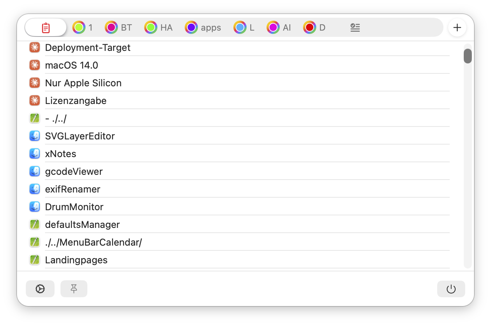

# xNotes

xNotes is a lightweight macOS menu bar notes app that keeps notes in colour-coded tabs, tracks a full clipboard history alongside them, and lets you cut repetitive typing with a built-in text expander. Define a short trigger, hint it with a snippet of any length — a signature, a standard reply, an address, a code block — and xNotes replaces the trigger with the full snippet the moment you type it, in whichever app you're working in.



## Features
- Menu bar popover for fast access
- Multiple tabs with titles and colors
- Lock tabs to prevent accidental close
- Auto title from the first non-empty line
- Clipboard history tab (always visible)
- Pinned clipboard slots (max 9)
- Source app name and icon for clipboard items
- Clipboard item transformations (case, JSON, URL, Base64, line tools, etc.)
- Text expansion rules and quick inserts
- Search across tab titles and content
- Export notes to text
- Backup export/import (JSON)
- Editor font and size settings
- Optional "keep window open" pin

## Requirements
- macOS 14.0 Sonoma or later
- Apple Silicon only

## Installation

### Build from source
Open `xNotes.xcodeproj` in Xcode and run.

### Prebuilt DMG

A ready-to-run build is available as `xNotes.dmg` (ad-hoc signed, Apple Silicon only). Since it isn't notarized by Apple, macOS blocks it on first launch. Remove the quarantine flag before opening:

```bash
xattr -dr com.apple.quarantine /Applications/xNotes.app
```

Alternatively, right-click the app in Finder and choose "Open".

---

## Usage

### Text Expansion
- Define short triggers that expand into longer snippets
- Manage rules in the Text Expansion view

### Clipboard
- New clipboard entries are captured automatically (text only)
- Duplicates are deduplicated; newest moves to top
- Pinned items stay at the top and are not removable
- Right-click an item for transformations and actions

### Search
- Search matches tab titles and content
- Navigation jumps to matching tabs

### Shortcuts
- `⌘1` … `⌘9` select tabs 1–9
- `⌥1` … `⌥9` paste pinned clipboard slots 1–9 (when Clipboard tab is active)
- `⌘F` open search
- `⌘G` next result
- `⇧⌘G` previous result
- Right‑click the menu bar icon for export/backup/quit

### Backup
- Export full app state (tabs + clipboard) as JSON
- Import JSON backup to restore

### Permissions
- Pasting into other apps requires Accessibility permission for xNotes.

## Notes
- Notes are stored locally in `UserDefaults` under the key `savedNotes`.

---

## License

This project is licensed under the [PolyForm Noncommercial License 1.0.0](https://polyformproject.org/licenses/noncommercial/1.0.0) — see [LICENSE](LICENSE) for details. Free for noncommercial use; commercial use requires a separate license from the author.
